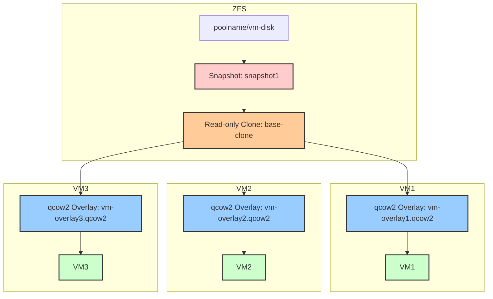

### Steps for Creating Linked Clones with Overlays

#### Step 1: Create a ZFS Snapshot of the Base VM Disk
1. Identify the ZFS dataset for your VM's disk:
   ```bash
   zfs list
   ```
   Suppose your VM disk is located at `poolname/vm-disk`.

2. Create a ZFS snapshot:
   ```bash
   zfs snapshot poolname/vm-disk@snapshot1
   ```

#### Step 2: Create a Read-Only Clone of the Snapshot
1. Create a ZFS clone from the snapshot, making it read-only:
   ```bash
   zfs clone -o readonly=on poolname/vm-disk@snapshot1 poolname/base-clone
   ```

#### Step 3: Create qcow2 Overlays for Each VM
1. For each VM, create a qcow2 overlay file that uses the read-only ZFS clone as the backing file:
   ```bash
   qemu-img create -f qcow2 -b /path/to/poolname/base-clone /path/to/vm-overlay1.qcow2
   ```
   Repeat this step for each VM.

#### Step 4: Define the New VMs in Libvirt
1. Create an XML configuration for each VM, pointing the disk to the corresponding qcow2 overlay:
   ```xml
   <disk type='file' device='disk'>
     <driver name='qemu' type='qcow2'/>
     <source file='/path/to/vm-overlay1.qcow2'/>
     <target dev='vda' bus='virtio'/>
   </disk>
   ```
2. Define and start the new VM:
   ```bash
   virsh define /path/to/vm1.xml
   virsh start vm1
   ```

#### Step 5: Repeat for Additional VMs
Repeat Steps 3 and 4 for each additional VM.

### Python Script for Automating the Process

```python
import subprocess
import os

def run_command(command):
    """Run a shell command and check for errors."""
    result = subprocess.run(command, shell=True, check=True, stdout=subprocess.PIPE, stderr=subprocess.PIPE)
    return result.stdout.decode().strip()

def create_zfs_snapshot(zfs_dataset, snapshot_name):
    """Create a ZFS snapshot."""
    command = f"zfs snapshot {zfs_dataset}@{snapshot_name}"
    run_command(command)
    print(f"Snapshot {zfs_dataset}@{snapshot_name} created.")

def create_zfs_clone(snapshot, clone_name):
    """Create a ZFS clone from a snapshot."""
    command = f"zfs clone -o readonly=on {snapshot} {clone_name}"
    run_command(command)
    print(f"Read-only ZFS clone {clone_name} created.")

def create_qcow2_overlay(base_clone, overlay_path):
    """Create a qcow2 overlay file with a ZFS clone as the backing file."""
    command = f"qemu-img create -f qcow2 -b {base_clone} {overlay_path}"
    run_command(command)
    print(f"qcow2 overlay {overlay_path} created based on {base_clone}.")

def define_and_start_vm(vm_name, overlay_path):
    """Define and start a VM with a qcow2 overlay disk."""
    vm_xml = f"""
    <domain type='kvm'>
      <name>{vm_name}</name>
      <memory unit='KiB'>1048576</memory>
      <vcpu placement='static'>1</vcpu>
      <os>
        <type arch='x86_64' machine='pc-i440fx-5.2'>hvm</type>
      </os>
      <devices>
        <disk type='file' device='disk'>
          <driver name='qemu' type='qcow2'/>
          <source file='{overlay_path}'/>
          <target dev='vda' bus='virtio'/>
        </disk>
      </devices>
    </domain>
    """
    vm_file = f"/tmp/{vm_name}.xml"
    with open(vm_file, "w") as f:
        f.write(vm_xml)
    
    run_command(f"virsh define {vm_file}")
    run_command(f"virsh start {vm_name}")
    print(f"VM {vm_name} defined and started with overlay {overlay_path}.")

def main():
    # Configuration
    zfs_dataset = "poolname/vm-disk"
    snapshot_name = "snapshot1"
    base_clone_name = "poolname/base-clone"
    vm_count = 3
    
    # Step 1: Create ZFS Snapshot
    create_zfs_snapshot(zfs_dataset, snapshot_name)
    
    # Step 2: Create ZFS Clone
    create_zfs_clone(f"{zfs_dataset}@{snapshot_name}", base_clone_name)
    
    # Step 3, 4: Create qcow2 Overlays and Define VMs
    for i in range(1, vm_count + 1):
        overlay_path = f"/path/to/vm-overlay{i}.qcow2"
        vm_name = f"vm{i}"
        
        create_qcow2_overlay(base_clone_name, overlay_path)
        define_and_start_vm(vm_name, overlay_path)

if __name__ == "__main__":
    main()
```

### Mermaid.js Diagram

Here's a Mermaid.js script to illustrate the process with a colored graph.



### Explanation

- **ZFS Block**:
  - The original disk (`vm-disk`) has a snapshot (`snapshot1`).
  - A read-only clone (`base-clone`) is created from this snapshot.
  
- **VM Blocks**:
  - Each VM (`VM1`, `VM2`, `VM3`) has a qcow2 overlay based on the `base-clone`.
  - These overlays store only the differences each VM makes, ensuring isolation.

This setup ensures efficient use of storage while maintaining isolation between VMs.